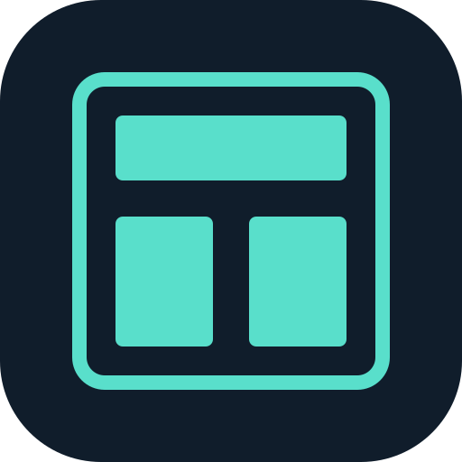

# Tenter

A Kotlin/JVM terminal-UI toolkit built on Mordant.

- [User documentation](https://archinautio.github.io/tenter/) — installation and usage guides.
- [Documentation source](docs/site/index.md) — read the guides in this checkout.
- [Architecture](docs/architecture.md) — module boundaries and implementation invariants.
- [Contributor and agent instructions](CLAUDE.md) — development commands and working conventions.
- [Documentation maintenance](docs/documentation.md) — preview, validation, and publishing.

## License

[Apache License, Version 2.0](LICENSE).
